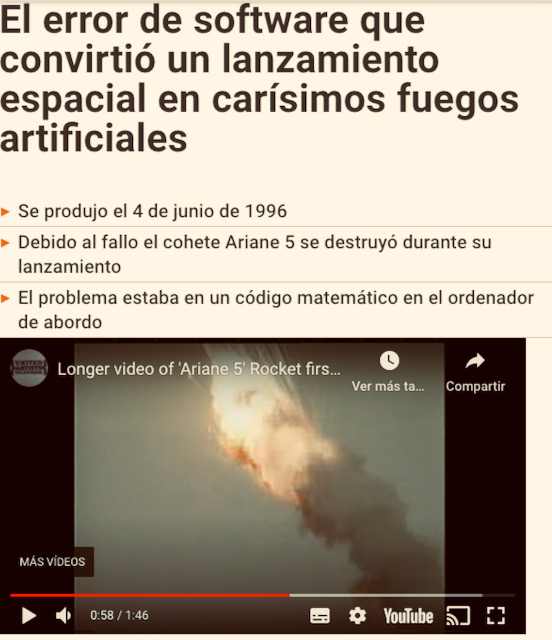
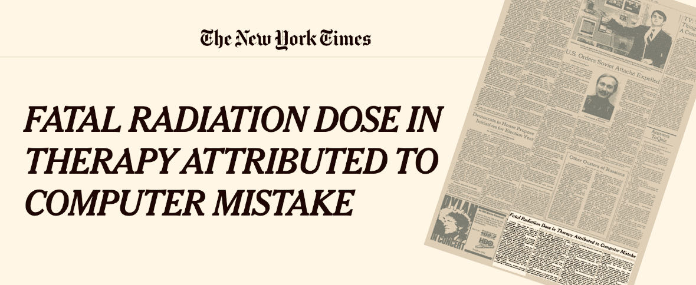
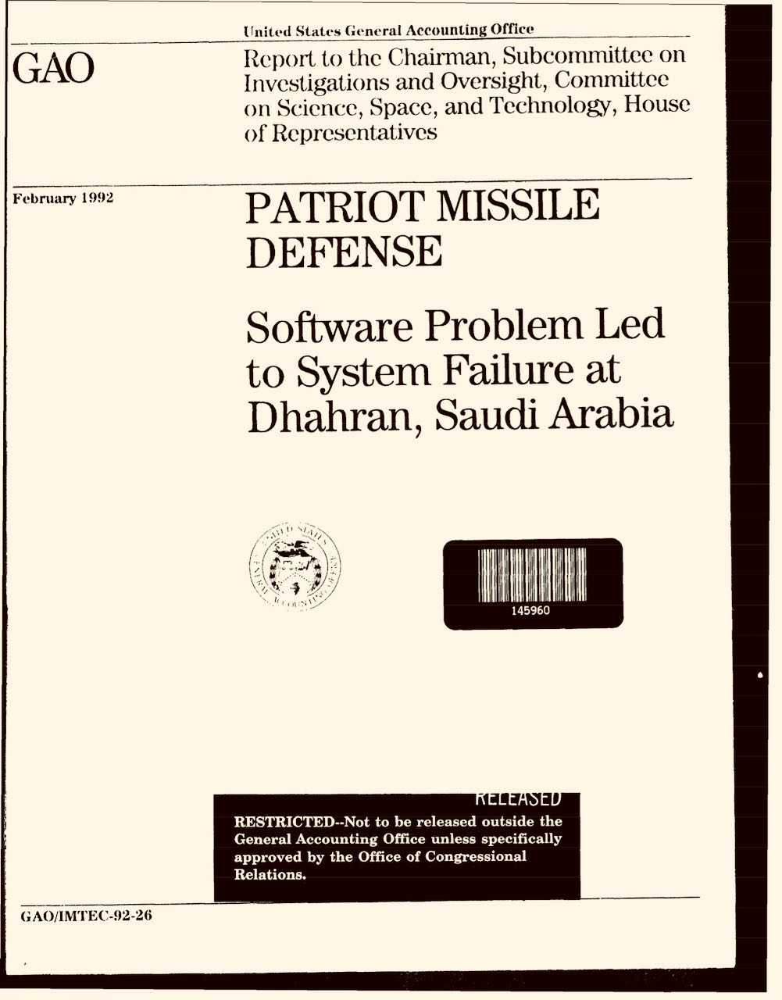

## Consecuencias de errores de software a lo largo de la historia

Para ver la importancia de tener software sin errores hemos visto algunas de las consecuencias más sonadas producidas por un error en el software. Hay más, pero a continuación dejamos 4 de ellas como curiosidad con enlaces para leer más información al respecto.

### Satélite Ariane

| <!-- -->    | <!-- -->    |
|:------------:|:-------------|
|           |Es un satélite que ha experimentado diversos errores a lo largo del tiempo. Por ejemplo, en 1996 sufrió una explosión y en 2018 se desvió de la ruta establecida. Ambos por errores en el software (según dicen) [Veinte años de la explosión del primer Ariane 5 por un fallo de software](https://www.microsiervos.com/archivo/espacio/veinte-anos-explosion-primer-ariane-5-por-fallo-software.html){:target="_blank"} [Un error en una cifra provocó el incidente de la misión VA241 del Ariane 5](https://danielmarin.naukas.com/2018/02/25/un-error-en-una-cifra-provoco-el-incidente-de-la-mision-va241-del-ariane-5/){:target="_blank"}|

### Therac-25 sobreexposición de pacientes a radiación

| <!-- -->    | <!-- -->    |
|:------------:|:-------------|
| | Se trataba de una máquina para radiar a pacientes oncológicos. Al parece algún problema hizo que se produjesen situaciones no controladas, que originaron que se diesen varias radiaciones a los pacientes. Algunos de ellos fallecieron. [Fata radiation dose in therapy attributed to computer mistake](https://www.nytimes.com/1986/06/21/us/fatal-radiation-dose-in-therapy-attributed-to-computer-mistake.html?searchResultPosition=1){:target="_blank"} [Killed by a machine: the Therac-25](https://hackaday.com/2015/10/26/killed-by-a-machine-the-therac-25/){:target="_blank"} [Accidentes Therac-25](https://lsi2.ugr.es/mvega/docis/aluwork/roddesastres/therac.htm){:target="_blank"}|

### Prisioneros liberados antes de tiempo en Michigan

| <!-- -->    | <!-- -->    |
|:------------:|:-------------|
| |Al realizar algunos cálculos sobre las fechas en las que algunos presos deberían salir libres, había un error lo que provocó que algunos saliesen libres hasta 100 días antes de lo que deberían. [Un fallo de software libera a más de 3000 reclusos](https://computerhoy.com/noticias/software/fallo-software-libera-mas-3000-reclusos-38563){:target="_blank"} [US prisoners released early by software bug](https://www.bbc.com/news/technology-35167191){:target="_blank"}|

### Misil Patriot - Guerra del Golfo

| <!-- -->    | <!-- -->    |
|:------------:|:-------------|
| |En base a la velocidad del misil y del momento en el que se avistaba se podía calcular en qué punto exacto se podría encontrar para ser derribado. Sin embargo, un retraso en el momento de detectarlo hizo que el cálculo no fuese acorde con la posición real. El misil no fue derribado e impactó en su objetivo dejando varios fallecidos. [El día que un misil mató a 28 soldados porque el sistema de defensa antimisiles ignoró un error de 0,000000095 segundos](https://www.xataka.com/historia-tecnologica/dia-que-misil-mato-a-28-soldados-porque-sistema-defensa-antimisiles-ignoro-error-0-000000095-segundos#:~:text=Tanto%20es%20as%C3%AD%20que%20el,en%20su%20sistema%20de%20detecci%C3%B3n){:target="_blank"} [Misiles Patriot y el error de Dharan. 0,33 segundos que costaron 28 vidas](https://decabo.com/informacion-y-actualidad/2008/07/24/misiles-patriot-y-el-error-de-dharan-033-segundos-que-costaron-28-vidas/){:target="_blank"} [Patriot missile defense. Software problem led to system failure at Dhahran, Saudi Arabia](https://www.gao.gov/assets/220/215614.pdf){:target="_blank"}|
