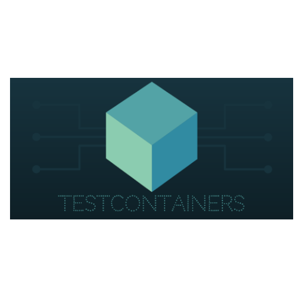
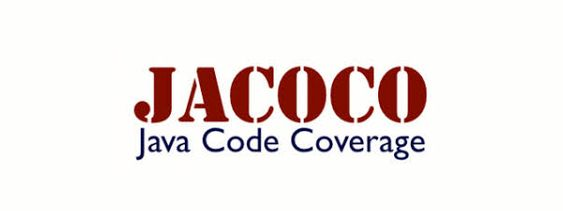
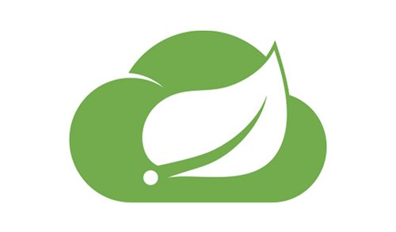
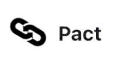

Evento de Enpresa Digitala (Grupo SPRI) impartido en formato online el 16 y 17 de marzo de 2021 ([ver información de la ficha](/docs/fichaSpri.md))

A continuación dejamos disponibles todos los recursos utilizados durante ambas jornadas.

## Código fuente y transparencias

<i class="fab fa-github"></i>  **Acceso a los repositorios de Github**

> Repositorio del servicio de **Farmacia** ([aquí](https://github.com/wearearima/farmacia-demo-bed-202103){:target="_blank"}).  
> Repositorio del servicio de **Almacen** ([aquí](https://github.com/wearearima/almacen-demo-bed-202103){:target="_blank"}).

<i class="fas fa-desktop"></i> **Acceso a las transparencias en PDF**

> Transparencias del día 1 ([aquí](https://drive.google.com/file/d/18S5MIy_aD67cr7Hl4zMipDon-caQ1gMx/view?usp=sharing){:target="_blank"}).  
> Transparencias del día 2 ([aquí](https://drive.google.com/file/d/1osOVw8WTrfeq2vLj2O3xZJF6BUYZ_jIw/view?usp=sharing){:target="_blank"}).

## Enlaces de interés

### Personas mencionadas
Hemos nombrado a algunas personas que son de interés a nivel de la comunidad de QA. A continuación os dejamos información sobre ellos por si os interesan:

<i class="fas fa-user-alt"></i> **Carlos Blé**  
> <i class="fab fa-twitter"></i> [@carlosble](https://twitter.com/carlosble){:target="_blank"}   
<i class="fas fa-blog"></i> [carlosble.com](http://www.carlosble.com/?lang=es){:target="_blank"}

<i class="fas fa-user-alt"></i> **Francisco Moreno**  
><i class="fab fa-twitter"></i> [@morvader](https://twitter.com/morvader){:target="_blank"}   
<i class="fab fa-twitter"></i> [@NorthemQuality](https://twitter.com/NorthemQuality){:target="_blank"}

<i class="fas fa-user-alt"></i> **Javier Martín de Agar**  
><i class="fab fa-twitter"></i> [@javimartinagar](https://twitter.com/javimartinagar){:target="_blank"}   
<i class="fas fa-blog"></i> [Mamá... ¿Qué es Scrum?](https://mamaqueesscrum.com/){:target="_blank"}

### Videos

**Las tres frases que mataron la calidad de software**  
><i class="fab fa-youtube"></i> [Ver en youtube](https://www.youtube.com/watch?v=yPPCn09ys9M&t=3h47m55s){:target="_blank"}   
_Javier Martin de Agar_. En QALovers Day 2020.

**Agile Testing**
><i class="fab fa-youtube"></i> [Ver en youtube](https://www.youtube.com/watch?v=92fI3wlyriI){:target="_blank"}  
_Carlos Blé_. Entrevistado por Autentia.

### Bugs de software sonados

[Aquí](/docs/bugsHistoria.md) os deja un documento con las consecuencias provocadas por algunos errores en el software que vimos el primer día.

### Relación de las ofertas relacionadas con QA

[Aquí](/docs/ofertas.md) os deja un documento con las ofertas que vimos el primer día sobre qué es lo que se pide actualmente relacionado con QA.

## Herramientas que hemos visto

A continuación os dejo el enlace de las herramientas con las que hemos ido trabajando a lo largo de las dos jornadas así como algunas de las que sin haber profundizado hemos nombrado.

### Base
Librerías base en las que hemos basado todo el desarrollo de los tests.

|:----:|:----:|
|            |    |
| [JUnit 5](https://junit.org/junit5/docs/current/user-guide/){:target="_blank"} | [Mockito](https://site.mockito.org/){:target="_blank"}   |

### Mockeo de estáticos/constructores
Desde la versión 3.4.0 Mockito ofrece esta posibilidad. Hay otra librería que nos ofrece también estas opciones (entre otras). Requiere tests de JUnit 4 y Mockito 2.

|:----:|
||
|[Powermock](https://github.com/powermock/powermock/wiki/Mockito#using-powermock-with-mockito){:target="_blank"}|

### Testcontainers
¿Testear sin tener que levantar nuestra bd?¿Hacer peticiones a otro servicio sin necesidad de tenerlo accesible?

|:----:|
||
|[Testcontainers](https://www.testcontainers.org/){:target="_blank"}|
  
### Calidad
Tradicionalmente se ha medido la calidad, teniendo en cuenta los informes de cobertura de código. Tras ver la fragilidad de estas métricas descubrimos el concepto de Mutation Testing Systems.

|:----:|:----:|
| Cobertura | Mutation Testing Systems |
| || 
|[JaCoCo](https://www.jacoco.org/jacoco/index.html){:target="_blank"}|[Pitest](https://pitest.org/){:target="_blank"}|

### Contract testing
Hemos visto la importancia de tener testeados cada uno de nuestros servicios, pero no debemos olvidarnos de que la comunicación entre ambos también debe ser testeada de alguna forma.

|:----:|:----:|
|            |    |
| [Spring Cloud Contract](https://spring.io/projects/spring-cloud-contract){:target="_blank"} | [Pact](https://docs.pact.io/){:target="_blank"}  |

